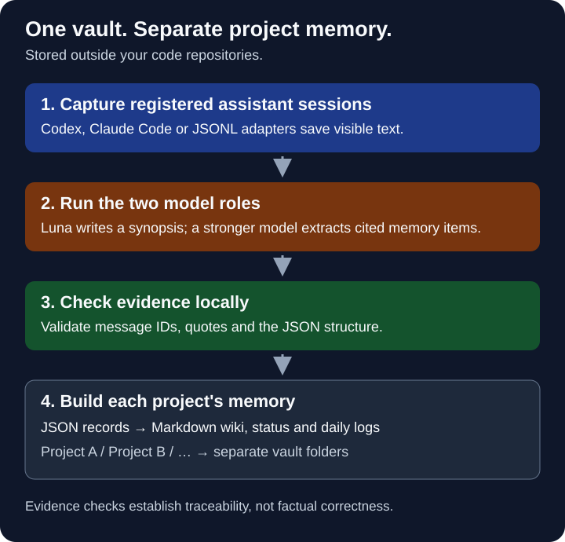

# SourceNest — portable project memory for AI coding assistants

## Pick up a project without retelling its history

SourceNest keeps project context across Codex, Claude Code, Cursor, and other AI coding tools on Windows. It captures visible user and assistant messages from registered projects, then compiles decisions, preferences, corrections, and open work into Markdown pages with links back to the source messages.

One private vault holds a separate folder for each project. The vault lives outside your code repositories. Its JSON records and Markdown pages do not depend on a model vendor, so you can change assistants or summarizers without rewriting the memory format. Automatic lifecycle hooks are available for Codex and Claude Code; a normalized JSONL bridge covers tools that expose an export or stream instead of a compatible hook.

[Install](#install-powershell) · [Common questions](#common-questions) · [Türkçe rehber](README.tr.md) · [Validation](VALIDATION.md) · [Privacy](PRIVACY.md)

**Current scope:** early release, with live capture tested on Windows + Codex CLI. Claude Code hook files and Cursor/normalized adapters are covered by local fixtures. Summaries currently use Turkish. The configured summary model is used only for a neutral queued synopsis; a separate, stronger extraction model produces source-backed decisions, preferences, corrections and tasks. Capture, context loading, source storage, evidence validation and Markdown rendering stay local. Local storage does not mean model calls are offline.



| When you need to… | SourceNest keeps… |
| --- | --- |
| pick up a project after a break | the project status, index, and durable context |
| remember why a choice was made | a dated record with a source message and quote |
| move from Luna to another model | the same portable records and Markdown views |
| work across several repositories | separate memory selected by the project path |

Each extracted item links to a source message and quote. Those checks help you trace a claim; they do not prove that the model interpreted it correctly.

### The path from a conversation to a page

<details>
<summary>Detailed capture and summarization flow</summary>

~~~mermaid
flowchart TD
    A[Codex / Claude / other session] -->|visible user and assistant text| B[Lifecycle hooks or JSONL bridge]
    B --> C[Immutable JSON event]
    C --> D1[Summary model<br/>Luna]
    C --> D2[Memory extraction model<br/>stronger model]
    D1 -->|neutral synopsis| E[Local validation]
    D2 -->|source-backed items| E
    E --> F[Project records]
    F --> G[Markdown topic wiki]
    F --> H[Daily log and decisions]
~~~

</details>

The extraction model proposes structured memory data. Local code checks the source IDs, evidence quotes, and schema before anything reaches the generated wiki.

[Türkçe kurulum ve kullanım](README.tr.md) · [Privacy](PRIVACY.md) · [Credits](CREDITS.md) · [MIT license](LICENSE)

## Status

Early release, engine 1.4.1. Windows + Codex CLI is the live-tested automatic integration; Claude Code wiring and provider-neutral adapters are included. Python 3.11+ and Git are required. No third-party Python dependencies.

The engine was live-tested with Codex CLI 0.154.0-alpha.6.2 and `gpt-5.6-luna`. Luna is the low-effort summary model; the default `gpt-5.6-sol` extractor uses high reasoning effort for source-backed decisions and corrections. Change `summarizer.model` or `extractor.model` in the installed vault's `config.json` when needed; `max` is available for either role when you prefer slower, deeper passes. The selected models must be available to your own account. CLI flags and hook formats can change between releases. Markdown summaries and engine messages currently use Turkish.

## How it works

1. Register a project directory once.
2. SessionStart supplies that project's status and index, plus shared preferences.
3. Lifecycle hooks capture new visible user/assistant text. The adapter identifies the source format; it does not change the vault schema.
4. A background summary model writes a neutral synopsis, while a stronger extraction model returns structured memory items. Local code validates evidence quotes, source IDs and schema.
5. Deterministic rendering creates a topic wiki, daily records and decision history.

Source text cannot choose output paths. Assistant proposals cannot become user decisions solely on assistant evidence. Quote validation does not prove that an interpretation is correct. Memory is historical data, never new authorization.

## Install (PowerShell)

Download and extract the repository, then open PowerShell in the extracted folder. Ensure `python` and `git` are available. Add the assistant homes you want to connect; Codex summarization also needs a working `codex login status`.

For the shortest path, let the helper find Python, the usual Codex/Claude folders and your existing vault. It prints a plan first:

```powershell
powershell.exe -NoProfile -File .\setup.ps1
```

If the plan is correct, run the same helper with `-Apply`. It creates a new vault or upgrades an existing one automatically:

```powershell
powershell.exe -NoProfile -File .\setup.ps1 -Apply
```

Use `-NoCodex`, `-NoClaude`, `-CodexHome 'D:\...'`, `-ClaudeHome 'D:\...'` or `-Vault 'D:\...'` when your layout is different. Check the result later with `powershell.exe -NoProfile -File .\setup.ps1 -Verify`.

The same helper can be launched from `setup.cmd` if you prefer a regular Windows command file.

Choose a **new, private vault folder outside this repository**. Installation refuses to overwrite an existing vault.

```powershell
python --version
git --version
codex --version
codex login status
$BeyinVault = Join-Path $env:USERPROFILE 'Documents\Beyin'
$BeyinCodexHome = if ($env:CODEX_HOME) { $env:CODEX_HOME } else { Join-Path $env:USERPROFILE '.codex' }
$BeyinClaudeHome = Join-Path $env:USERPROFILE '.claude'
python install.py --target "$BeyinVault" --codex-home "$BeyinCodexHome" --claude-home "$BeyinClaudeHome" --registry projects.example.json
```

This prints the installation plan. To apply it:

The example registry is empty. Installation connects no projects until you run the registration command below. If `python` is unavailable but `py -3 --version` reports Python 3.11 or newer, use `py -3` in place of `python` throughout these commands.

```powershell
python install.py --target "$BeyinVault" --codex-home "$BeyinCodexHome" --claude-home "$BeyinClaudeHome" --registry projects.example.json --apply
```

The installer merges five Codex lifecycle hooks into `hooks.json` and five Claude Code hooks into `settings.json`, then adds a scoped memory block to Codex `AGENTS.md` and Claude `CLAUDE.md`. Existing integration files are backed up inside the private vault. It does not change hook trust or permissions. Review the generated commands in each assistant before enabling them, then start a fresh session in a registered project.

If the vault already exists, use the upgrade command. It updates the managed engine, connects the selected assistants, and creates a dated backup; project data and configuration stay in place:

```powershell
python install.py --target "$BeyinVault" --codex-home "$BeyinCodexHome" --claude-home "$BeyinClaudeHome" --upgrade
```

See [assistant integrations](docs/integrations.md) for Claude Code settings, Cursor exports and the normalized JSONL shape. There is no universal hook format shared by every AI application; tools without a transcript hook use the bridge described there.

## Register a project

Replace the example with an existing directory:

```powershell
python "$BeyinVault\engine\beyin.py" register --project my-project --path 'D:\Projects\MyProject' --name 'My Project'
python "$BeyinVault\engine\beyin.py" doctor
```

Project IDs use lowercase ASCII letters, digits and hyphens. Paths determine the project; unrelated chats are excluded. Existing history is not bulk-imported on installation. On first attachment to a resumed session, the cursor skips earlier history.

## Commands

```powershell
python "$BeyinVault\engine\beyin.py" context --cwd 'D:\Projects\MyProject'
python "$BeyinVault\engine\beyin.py" context --cwd 'D:\Projects\MyProject' --query 'model tercihleri'
python "$BeyinVault\engine\beyin.py" search --project my-project --query 'database'
python "$BeyinVault\engine\beyin.py" alias --project my-project --topic 'Database' 'db' 'veritabanı'
python "$BeyinVault\engine\beyin.py" ingest --project my-project --file 'D:\Documents\Research.md' --title 'Research'
python "$BeyinVault\engine\beyin.py" capture-file --project my-project --file 'D:\Exports\session.jsonl' --adapter normalized --session exported-session
python "$BeyinVault\engine\beyin.py" process --retry
python "$BeyinVault\engine\beyin.py" preferences
python "$BeyinVault\engine\beyin.py" preferences --profile economical
python "$BeyinVault\engine\beyin.py" preferences --profile manual
python "$BeyinVault\engine\beyin.py" rebuild --project my-project
python "$BeyinVault\engine\beyin.py" pause
python "$BeyinVault\engine\beyin.py" resume
```

`pause` disables automatic capture; it does not terminate an already running worker. `resume` re-enables capture; use `process --retry` to explicitly retry processing after fixing errors. `doctor` checks login, queue and worker health; it is not a live model test. PDF input must first be converted to text. URLs are source metadata, not automatic downloads.

## Where your memory lives

Rejected evidence stays queued and does not block other jobs. After three failed attempts, the job waits for review (`doctor.needs_review`); use `process --retry` to retry it. A login check inside a different Windows sandbox account may not see your saved credentials. Confirm `codex login status` in your normal Windows session before signing in again.

```text
Beyin/                         # private vault, outside the source repository
├── config.json                # model and call limits
├── projects.json              # registered project paths
├── PROFILE.md                 # shared preferences
└── projects/
    ├── my-project/
    │   ├── raw/               # captured events and imported sources
    │   ├── records/           # validated structured summaries
    │   ├── wiki/              # generated index and topic pages
    │   ├── aliases.json       # optional local topic aliases for search
    │   ├── daily/             # generated daily logs
    │   ├── STATUS.md
    │   ├── DECISIONS.md
    │   └── notes/             # your manually maintained notes
    └── another-project/       # separate project memory
```

The private vault contains `projects/<id>/raw`, `records`, `wiki`, `daily`, `STATUS.md`, `DECISIONS.md`, and `notes`. Put manual notes in `notes`; generated views are rebuilt by the engine. Keep separate backups: local Git checkpoints are not an off-device backup.

## Changing models and managing usage

When queued work is processed, the two configured roles use your Codex account, with at most 4 model calls per run and 20 per UTC day across the vault. With the split defaults, one queued event uses two calls: one Luna synopsis and one stronger extraction pass. These are call limits, not monetary limits. The `normal` profile keeps those defaults; `economical` lowers them to 2 per run and 8 per day; `manual` keeps capture available but waits for an explicit `process --retry`. Errors retain queued work; processing resumes on later hooks or an explicit retry, not a timer. Memory context, summary and extraction consume tokens.

Change `summarizer` to choose the neutral synopsis model and `extractor` to choose the stronger model that classifies important memory items. Both settings use the same provider choices: `codex_cli` is live-tested; `openai_responses` and an explicit local `command` adapter exist but are not live-verified across providers. API use requires its own environment credential and billing. The command adapter receives the role-specific prompt on stdin and must return the matching SourceNest JSON schema on stdout; `{model}` arguments are substituted without shell evaluation. If `extractor` is omitted, the engine falls back to the legacy single-model combined schema for compatibility.

Codex and Claude Code use lifecycle hooks; Cursor and other tools can feed a compatible JSONL export through `capture-file`. Capture, summary and extraction are separate roles: changing any model does not change stored records. Files remain readable without any model.

## Common questions

### Do Codex and Claude Code remember previous sessions automatically?

With SourceNest installed, its hooks enabled, and your project registered, a new Codex or Claude Code session receives that project's status and wiki index plus shared preferences. Capture and summarization add new material as you work. The startup context is bounded; it does not load every previous conversation.

### Is this a second brain or an LLM wiki?

SourceNest combines automatic session memory with a source-backed Markdown wiki. It is intended for ongoing coding projects: decisions and open work are kept with references to the messages behind them. It draws on the source-to-wiki and session-memory ideas acknowledged in [Credits](CREDITS.md).

### Can I switch models without losing my notes?

The stored JSON and Markdown files remain available when you change the summary model, extraction model or assistant. A provider must return the expected role-specific output; the `command` adapter lets you wrap a local CLI that does so. Apps without a transcript hook need an export or bridge, while the vault itself stays unchanged.

### How do I search the memory?

Use the local Markdown search command. It searches the selected project's generated topic pages, status and decision views without sending the query to a model. Add human-maintained aliases when a team uses more than one name for a topic:

```powershell
python "$BeyinVault\engine\beyin.py" search --project my-project --query 'db'
python "$BeyinVault\engine\beyin.py" alias --project my-project --topic 'Database' 'db' 'veritabanı'
```

`context --query` adds the same bounded results to a new session's context. SourceNest stores ordinary Markdown and JSON files; it does not require a hosted search service or embedding database.

### Is SourceNest local and free to use?

The software is MIT-licensed and stores memory in a private local vault. Summarization sends captured text to the configured model provider and uses your account's quota or API billing. See [Privacy](PRIVACY.md) for the full data flow.

### Can one installation serve several repositories?

Yes. Register each project path once. A single vault holds separate project folders, and the current path selects the memory supplied to a session. Shared preferences live in the vault's PROFILE.md.

## Help and contributions

Maintained by [noon49-code](https://github.com/noon49-code). Report reproducible problems in [GitHub Issues](https://github.com/noon49-code/SourceNest/issues), including your Windows, Python and assistant/CLI versions. Use synthetic examples instead of private transcripts. See [Contributing](CONTRIBUTING.md) for changes and [Validation](VALIDATION.md) for the tested scope.

## Tests

```powershell
python -m unittest discover -s tests -v
```

Tests run in temporary directories and do not call a model. The engine was additionally tested with real Codex lifecycle capture, both conversation roles, background Luna summarization and source hashes. Claude hook settings, Cursor-shaped records, normalized JSONL capture and integration-only upgrades are covered by synthetic tests. Private transcripts and live reports are deliberately excluded from this repository. See [VALIDATION.md](VALIDATION.md).

## Disable or remove

Run `pause` first. Remove only the commands pointing to this vault from Codex `hooks.json` and/or Claude `settings.json`, plus the `BEGIN BEYIN PORTABLE MEMORY` block from the relevant `AGENTS`/`CLAUDE.md` file. Preserve other hooks and instructions. Restart sessions. Backups under the vault's `.backups` are for inspection; restoring whole files could overwrite later unrelated edits. Your vault data remains available.

## Scope

No hosted service, telemetry, automatic cloud backup, embedding database or global conversation archive. Summaries can be incomplete or wrong, and abrupt termination may prevent capture. Protect the private vault and its Git history; publish only this source repository.

## Compatibility / Uyumluluk

SourceNest is the public project name. The engine retains the Beyin command names, default vault folder and hook markers for compatibility with existing installations.
